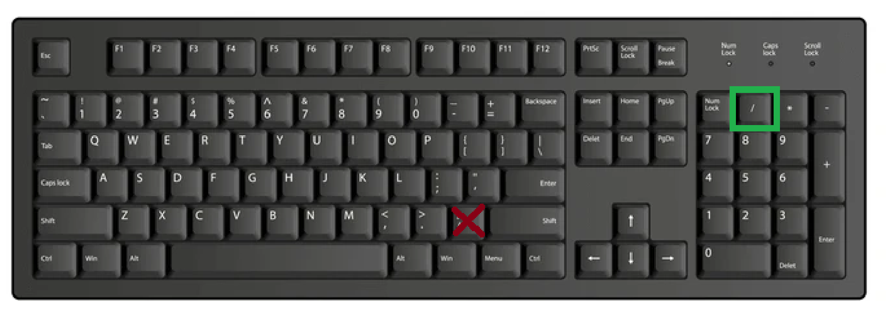

# SCUM MiniMap v1.6.4

SCUM MiniMap is an external map overlay and navigation utility for SCUM, made for the Skynett community. It displays player location, heading, road routes, points of interest, and custom waypoints. It does not read game memory or inject DLLs; this is not an official anticheat certification.

Run `SkynettMiniMap.exe` from the extracted release directory. High-resolution map artwork, road networks, and over 8,000 categorized ScumMap points of interest across 106 categories are embedded directly into the executable.

> [!IMPORTANT]
> SCUM must run in **Borderless Window** or **Windowed** mode. Windows exclusive fullscreen mode takes dedicated hardware control of the display and suppresses external desktop overlays.

> [!IMPORTANT]
> **COPY LOCATION: NUMPAD / IS THE DEFAULT. SCUM'S KEY MUST MATCH MINIMAP.**
> In SCUM Controls, bind **Copy Location** to **NumPad / (number-pad divide), without Ctrl, Shift or Alt**, and select the same key in MiniMap. Existing saved bindings are retained: if you use another key, it must match in both applications. Without a matching binding, automatic position tracking will not work.

MusicalScumbag users: update MusicalScumbag to the corrected build with **F10** auto-walk. Its older NumPad / auto-walk shortcut conflicts with MiniMap's automatic Copy Location presses.

---

## Official Distribution & Automatic Updates

### Admin command panel

Opening the expanded map shows a slim **Admin** tab beside the map's left edge, with a gap between them. It starts horizontally collapsed each time you open the map; click the arrow to expand it to the left. The map keeps its original full-screen size and position. The panel fits the available space beside it, with scrolling for wider content; the attached tab is hidden when there is insufficient space for it. **Commands** and **Directional teleport** have their own expandable sections, with shortcuts on the tab. The panel shares the full-map sidebar's blue-black background, compact text, rounded buttons, orange selections and thin blue scrollbar. Close hides it until the next map opening, and it hides with the map, focus loss or Ctrl map interaction. Settings and the tray still offer explicit access when the full map is closed.

Open the full map's **Admin commands** dropdown from its right-click menu or sidebar Tools section. Select a command, then **ON** or **OFF** to send `true` or `false` for God mode, player info or nameplates. The panel also offers a toggle button and explicit **ON**/**OFF** buttons. **Edit commands…** opens the editor to add, edit or remove commands; enter the base command without its final true/false argument. The editor is also accessible from Settings and the tray menu. Existing On/Off button pairs migrate into one command. Displayed values are the last submitted requests and start **UNKNOWN** each session; use **OFF** to disable an effect that is already active in SCUM. Check SCUM for the actual state.

The presets send `#SetGodMode true/false`, `#ShowOtherPlayerInfo true/false` and `#ShowNameplates true/false`. God mode is SCUM's blueprint building mode; the server must grant the relevant admin permission. The panel cannot read the live state or confirm that a command succeeded.

Choose **Directional teleport…** in the dropdown, or open the admin panel, to teleport from your latest received position. Select **Up**, **Down**, **Left**, **Right**, **Forward** or **Back**, enter a distance in metres (20 by default), review the command preview, then click **Send teleport**. Left/right/forward/back use your last recorded facing direction and keep the same elevation; up/down change only elevation. MiniMap converts metres to SCUM coordinate units and sends a clean `#Teleport X Y Z` command. The coordinate age is shown beside the source position. After submission, another step waits for a new coordinate reading from SCUM; the app keeps your actual recorded position until that reading arrives.

Close chat and inventory, then click the required button. MiniMap closes the dropdown before focusing SCUM, pauses location copying and shortcuts throughout command preparation, closes the expanded map when needed, opens chat using your configured physical chat key, pastes the displayed command, presses Enter, then sends Escape to dismiss chat. The sequence uses shorter delays and checks for held keys before starting. Avoid keyboard or mouse actions while it sends. Focus changes, physical input or another clipboard update stop further submission; if interrupted after chat opens, close SCUM chat before retrying. Once Enter is dispatched, the requested value is recorded even if Enter release or Escape cleanup is interrupted. Sends cancelled before Enter leave the last submitted value unchanged.

Open the **Commands** section and use **Add command**, **Edit** or **Remove** to manage your own single-line commands beginning with `#`. Buttons persist in `admin-commands.tsv` in your active user data folder. Location copying pauses during sending. The previous clipboard is restored only if no other application or action has replaced it.

The editor provides **Label**, **Command**, an **Is boolean?** checkbox, **Quantity (optional)** and **Extra strings (optional)**. New commands start with the checkbox unchecked and run once. Check it for a command that accepts true/false to create an On/Off toggle. Enter a positive whole-number quantity when needed, and any additional single-line arguments in Extra strings. The preview shows the assembled command in this order: command, boolean value when enabled, quantity, extra strings. Leave unused fields blank; existing saved toggle commands remain compatible.

Official binaries, update manifests, and cryptographic checksums are distributed exclusively via GitHub Releases:

* **Official Repository:** [Mike-Rafone-SCUM/MiniMap](https://github.com/Mike-Rafone-SCUM/MiniMap)
* **Latest Release:** [GitHub Releases Latest](https://github.com/Mike-Rafone-SCUM/MiniMap/releases/latest)
* **Standalone Executable:** [SkynettMiniMap.exe](https://github.com/Mike-Rafone-SCUM/MiniMap/releases/latest/download/SkynettMiniMap.exe)
* **Complete Archive:** [SkynettMiniMap.zip](https://github.com/Mike-Rafone-SCUM/MiniMap/releases/latest/download/SkynettMiniMap.zip)

### Integrated Auto-Updater
SCUM MiniMap checks the version in the official `update.txt` manifest at startup. Startup results are cached for up to an hour; manual checks through **Check for updates (GitHub)** in the tray menu or Settings reuse results for up to one minute. A newer release prompts you to update. After your confirmation, its SHA-256 checksum is verified and the download is staged beside the installed executable.

Close the restart prompt to let the update helper replace the executable and restart the app. The helper verifies the staged file again, retains the previous executable until launch succeeds, and records the installation result. Saved settings and zones are retained. For manual downloads, exit the app from its tray menu before replacing the executable.

### Discord support

Join the [SCUM MiniMap Discord](https://discord.gg/MYzcGaFDMn) for downloads, release notices, guides, and support. Official information is in English; translation buttons provide private translations on demand. Localised community chats are also available. The app's language setting is separate from Discord.

---

## Copy-key setup



Keyboard illustration supplied by a member of the SCUM MiniMap Discord. The green box marks **NumPad /**; the red cross marks the main keyboard slash key. Bind SCUM's **Copy location** to the same key selected in MiniMap.

The default for new installations is **Num / (number-pad divide) without a modifier**. In SCUM controls, manually bind **Copy location** to that same key. MiniMap cannot change SCUM's controls. If your keyboard has no number pad, choose another unused single key in SCUM and capture it in MiniMap's setup guide or key wizard.

Existing saved bindings are preserved. When switching from Ctrl+C, select **Single key without modifier** in MiniMap as well. Single-key tracking supports a 250 ms interval without injecting Ctrl; Ctrl+C remains supported at a minimum one-second interval. Actual updates depend on SCUM supplying coordinates.

On ABNT2 and other non-US keyboards, use **Capture** beside Copy Location in MiniMap's key wizard: it saves the physical scan code of the key you press and sends that same key to SCUM. Map, Chat and every MiniMap shortcut also support physical-key capture. Existing saved bindings remain intact until you change them.

Open **SCUM and MiniMap key rebinding wizard** in Settings to configure all game bindings and app actions together. Match SCUM Map, Chat and Copy location to the game's controls; MiniMap cannot change those controls for you. The same configured SCUM Map key opens and closes both SCUM's map and MiniMap's expanded overlay. See [Controls & Keybinds](#controls--keybinds) for the complete app action list.

## Optional voice navigation (work in progress)

Voice navigation is **off by default**. Enable it in Settings, select **Lyan (Female US)**, set the volume and use Preview voice. Guidance includes distance/turn prompts, arrival and wrong-way handling. Accuracy and prompt timing are still being refined; check the map and road signs when following a route. Recalculation appears on screen; the bundled clips do not include spoken “recalculating”.

In Settings, **MiniMap shortcuts (single keys)** lets you capture or unbind every app action, including zoom, map visibility, waypoint tools and admin commands. The key rebinding wizard offers the same controls. Click an action and press a single physical key without Ctrl, Alt, Shift or Windows; Escape cancels capture. Duplicate shortcuts, reserved game/dialog controls and keys already used by SCUM Map, Chat or Copy location are rejected. For number-pad keys, keep Num Lock in the same state when capturing and using the key. Preferences are saved per user. If the default keys are unavailable, open Settings through the taskbar or tray menu first. Chat editing retains priority over shortcuts, and Add waypoint requires a received location.

In Settings, **History duration (minutes)** controls how long the recorded route trail remains visible (1–240 minutes; default 30). **Clear route history** removes the current trail immediately; tracking starts a new trail with subsequent samples. Reducing the duration removes older points immediately, including while stationary. Increasing it retains future history longer; expired or cleared points cannot be restored. These preferences are saved per user; trail points last only for the current session.

Additional voices can be added as folders under `%LocalAppData%\ScumMiniMap\voice-navigation`, with these 12 filenames, then selected after reopening Settings:

`01_500_meters.mp3`, `02_250_meters.mp3`, `03_100_meters.mp3`, `04_50_meters.mp3`, `05_continue_straight.mp3`, `06_turn_left.mp3`, `07_turn_right.mp3`, `08_keep_left.mp3`, `09_keep_right.mp3`, `10_make_a_u_turn.mp3`, `11_in.mp3`, `12_you_have_arrived.mp3`.

Optional `13_recalculating.mp3` adds a spoken recalculation notice. Keep-left/right clips remain part of pack compatibility but are not currently used for junction guidance.

## Changes in v1.4.9

- A glowing arrow on the minimap edge points toward your final destination. Circular maps also show a short glowing arc. The indicator uses your route colour and works independently of voice navigation; it indicates the endpoint bearing, not the next road turn.
- Position and heading continue updating while the full map is open with SCUM’s map cursor visible. Chat, focus and physical-input protections remain active.
- The configured **Settings** shortcut (<kbd>Home</kbd> by default) restores Settings from the taskbar and brings it forward. Repeated presses keep it open; use Escape, Done or Close to minimize it.
- Circular clipping and indicator placement stay aligned with status bars above or below the map, including full opacity with edge fading disabled.

## Key Features

### In-Game Full Map Mode
Pressing your configured **SCUM Map** key (<kbd>M</kbd> by default) during gameplay transitions the minimap into a full-scale, 1:1 square tactical map centered directly over SCUM's built-in in-game map.
* **Full Monitor Height & Centering:** Unconstrained display geometry detection expands the overlay to the full display height (1080p, 1152p, 1440p, 4K) and horizontally centers it (`(ScreenWidth - ScreenHeight) / 2`), leaving peripheral HUD elements (health, stamina, speedometer) visible.
* **Mouse Wheel Zoom & Pan:** Roll the mouse wheel while viewing the full map to zoom smoothly from 1.0x up to 16.0x towards the cursor. Click and drag with the left mouse button to pan across the island. Right-click opens map actions, including resetting the view and adding a custom waypoint at the clicked location.
* **Floating Opacity Slider:** An interactive glass pill at the top-right corner allows adjusting overlay opacity in real time from 20% to 100%, letting you see through the overlay directly into the game environment.
* **Mouse Input:** The compact minimap passes mouse input through to the game. The expanded map keeps keyboard focus in SCUM while supporting zooming, panning and opacity controls. Hold either **Ctrl** key to temporarily hide the expanded overlay and click SCUM's map directly, so admins can select players and use SCUM teleport actions. Release Ctrl to restore MiniMap and its controls. Completing a Ctrl-left-click on the exposed map collapses MiniMap to its compact view and clears stale chat and inventory input locks for admin teleporting. Clicks use the underlying game map's current position and zoom.
* **Smart Auto-Restore:** Restores normal minimap dimensions and position when pressing the configured Map key again, pressing <kbd>Esc</kbd>, or switching away from the game. Cursor hiding alone does not close the overlay.

### Custom Waypoints & Search List Management
* **Death markers:** Automatic death markers are enabled by default and can be disabled in Settings under MiniMap shortcuts. MiniMap recognises the death-screen layout: a prominent red text heading above three aligned dark respawn buttons with visible labels. One complete layout match saves a tombstone immediately using the last known coordinates captured before that frame. Detection must then miss fourteen consecutive samples (about ten seconds) before another death can be marked. Detection does not read the wording, so translated text needs no calibration or extra key press. Detection operates on the heading and respawn panel; a right-side map is not required.
* **Manual death marker:** Use **Add death marker** (<kbd>Down</kbd> by default) at the death screen before respawning to save the last received location. Markers appear on the minimap and full map, persist in the current map's waypoint file, and support navigation and deletion through the waypoint list. Using this action after receiving respawn coordinates marks the new location. Chat, inventory, dialogs, modifiers and conflicting bindings retain priority for this shortcut. Markers follow custom-waypoint visibility settings.
* **Death marker age and collection:** Labels show relative age, such as Death 12m ago, including markers created by previous versions. Tracking must first see you at least 50 metres away, then returning within 25 metres removes the marker permanently and clears navigation to it. Ordinary waypoints are retained. Labels update every ten seconds while MiniMap is running.
* **Automatic detection limits:** SCUM must be foreground, with the heading and respawn panel unobstructed and MiniMap's expanded map, Settings and dialogs closed. Automatic placement uses the last known location received in the current session, even when death or menus pause tracking for more than 30 seconds. An older sample may be less precise if you moved after tracking stopped. If MiniMap has never received coordinates, the death is skipped; subsequent respawn coordinates are not substituted. Detection uses local screen pixels, without game memory access, online OCR or stored screenshots. It depends on the red-heading/three-button layout; substantially different death screens may be missed. The configured Add death marker shortcut remains available as a manual fallback. The supplied recording's fade and outlined respawn selection pass regression checks. A bounded `death-detection.log` in the active data folder records blocked detection, unavailable captures, confirmation and saved/skipped/failed markers with coordinate age, without recording coordinates or screenshots.
* **Save at Current Location (Insert by default):** Use the Add waypoint shortcut while playing to capture your current GPS coordinates. A dialog lets you name the location, saving it in the current map's `customwaypoints.tsv` with a cyan marker.
* **List Management & Right-Click Deletion:** Open the waypoint list with your configured Search shortcut (<kbd>Delete</kbd> by default) to search, navigate to, or manage locations. Right-clicking any custom waypoint displays a context menu to delete it, or highlight it and press <kbd>Delete</kbd> while the list is focused.
* **Proximity Clearing:** Using Add waypoint within 50 meters of an existing custom waypoint prompts you to delete it directly in the field. Clear waypoint removes the active navigation destination; it does not delete saved waypoints.
* **SCUM and MiniMap Key Rebinding Wizard:** Settings can capture every SCUM binding used by MiniMap and every app action, including zoom in/out, show/hide map, waypoint actions and tools. SCUM bindings must match the game; app shortcuts can be changed or unbound. This prevents custom bindings such as Ctrl for free look from moving the camera during tracking.

### Road-Aware GPS Navigation
* **A* Driving Route Pathfinding:** Real-time pathfinding across SCUM's road network calculates driving trajectories, turns, and remaining road distance in milliseconds.
* **Calibrated Alignment:** Calibrated coordinate transform offsets (+200 cm X/Y) ensure vehicle markers and navigation trajectories align directly along road centrelines.
* **High-Contrast Feeder Vectors:** Off-road dashed guidance lines connect your vehicle to the nearest road entry point.

### POI Filtering & Smart Label LOD
* **POI Filters:** Use Configure POI filters or the full-map category list for locations such as gas stations and bunkers. Custom waypoints and imported zone layers have separate visibility controls.
* **Independent Bunker Filtering:** Bunkers and abandoned underground facilities can be shown or hidden independently from surface military sites.
* **Smart Level of Detail (LOD):** When zoomed out (< 2.5x), minor text labels (towns, farms, military sites, faction tags) are automatically suppressed to keep terrain and roadways clean and legible. Only major Cities, Traders, and Custom Waypoints display text labels. Detailed local tags smoothly reappear as you zoom in closer.
* **Independent Border & Label Controls:** Toggle POI text names (`ShowZoneLabels`) independently from colored zone borders (`ShowZones`).

### Interface Languages
Choose English, Argentine Spanish, French, German, Dutch, Russian, Simplified Chinese, Turkish, Arabic, or Brazilian Portuguese in Settings without restarting. The initial language follows your system language. All ten UI catalogues are checked for matching keys and formatting placeholders during builds.

### Custom Map Textures & Zone Import
* Supports a custom `map.png` texture in `%LocalAppData%\ScumMiniMap`. Each map image receives an isolated profile under `maps\<map-id>\` with separate `zones.tsv` polygons and `customwaypoints.tsv` waypoints. Map IDs are derived from the image contents, so replacing `map.png` with another upload automatically switches to that map's saved annotations.
* Existing root-level `zones.tsv` data is migrated once to the map active on the first launch after this update. The original file is retained as a backup and is not copied to other map profiles.
* Includes a **Reset to default map** option to revert to embedded high-resolution assets without manual file deletion.

---

## First Launch: Size and Position

New installations start with a compact 240 × 240 minimap in the upper-right corner. The setup guide's **Move and resize minimap** button opens the Appearance settings. Switch to the desktop to drag the minimap into position or drag its edges to resize it; use **Settings → Appearance** for exact width and height. Changes save automatically. Reopen the setup guide from Settings whenever needed.

Existing saved layouts are retained. Opening the full map does not replace your saved minimap size or position.

## Controls & Keybinds

All twelve MiniMap app actions are configurable through **MiniMap shortcuts (single keys)** in Settings and the **SCUM and MiniMap key rebinding wizard**. The startup guide uses the same saved bindings. These are the defaults; displayed shortcut hints follow your configured keys.

| MiniMap action | Default | Effect |
|---|---|---|
| Settings | <kbd>Home</kbd> | Open or restore Settings |
| Add waypoint | <kbd>Insert</kbd> | Save a named waypoint at the last received location; offers removal near an existing waypoint |
| Search | <kbd>Delete</kbd> | Open waypoint search and destination navigation |
| Show / hide map | <kbd>End</kbd> | Toggle overlay visibility |
| Zoom in | <kbd>Page Up</kbd> | Increase manual zoom in the compact or full map |
| Zoom out | <kbd>Page Down</kbd> | Decrease manual zoom in the compact or full map |
| Add death marker | <kbd>Down</kbd> | Save a death marker at the last received location |
| Reset zoom | Unbound | Restore the default map view |
| Clear waypoint | Unbound | Clear the active navigation destination |
| Zone Creator Wizard | Unbound | Open the zone editor and import tools |
| Getting Started Guide | Unbound | Open the startup guide |
| Admin commands | Unbound | Open the admin command panel |

**Capture** assigns a single physical key without modifiers. **Unbind** disables an app shortcut while its button or menu entry remains available. **Reset defaults** restores the standard SCUM and app bindings in the wizard; the five additional tool actions above return to Unbound. Check SCUM's controls before saving reset game bindings. Existing saved bindings are retained during updates, and accepted changes persist per user in `settings.ini`, including physical scan codes and unbound actions.

Each assigned app shortcut must be distinct from other app shortcuts and SCUM Map, Chat and Copy location. Reserved game/dialog controls are rejected. Capture and Save validate these conflicts; the rebinding wizard keeps changes pending until Save, so Cancel leaves the previous bindings intact. The startup guide also keeps a draft while moving between pages and saves all controls together when finished. Keyboard shortcuts respect chat, inventory, dialogs, held modifiers and admin-command sending. Bindings control app actions; they do not change SCUM's controls or reassign standard mouse gestures and dialog navigation.

| Input | Context | Action |
|---|---|---|
| Configured SCUM Map key (<kbd>M</kbd> by default) | In game | Toggle SCUM's map and the full-map overlay together; ignored while typing in chat |
| Configured SCUM Chat key | In game | Open SCUM chat and pause MiniMap shortcuts and coordinate copying |
| Configured Copy location key/modifier (<kbd>Num /</kbd>, no modifier, by default) | In game | Copy coordinates for tracking; must match SCUM |
| <kbd>Left Click</kbd> | Full map | Place or route a GPS marker; click it again to clear |
| <kbd>Mouse Wheel</kbd> | Full map | Zoom from 1.0x to 16.0x toward the cursor |
| <kbd>Left Click + Drag</kbd> | Full map | Pan when zoomed in or drag the opacity slider |
| <kbd>Right Click</kbd> | Full map | Open waypoint, view and admin actions |
| <kbd>Ctrl</kbd> | Full map | Temporarily expose SCUM's map for direct interaction |
| <kbd>Escape</kbd> | Dialog or full map | Cancel capture, close the active dialog or exit full-map mode |

---

## Intelligent Search & Navigation

* **Fuzzy & Phonetic Matching:** Accent-insensitive, typo-tolerant search handles aliases and abbreviations (e.g., `mil air`, `airfeild`, `nafta`, `bunker C3`, `nearest trader`).
* **Sector Search:** Enter any sector code (`D4`, `C2`, `B0`) to highlight and navigate to the sector center.
* **Auto-Clear on Arrival:** Active navigation targets clear automatically once your character arrives within 30 meters of the destination.

---

## Architecture & Anticheat Safety

SCUM MiniMap runs as an external Windows application:

* **Zero DLL Injection:** Operates entirely outside the SCUM process space as a standard layered Windows desktop utility.
* **No Game Memory Access:** Does not attach debuggers, inspect process RAM, hook DirectX/Vulkan APIs, or modify game files.
* **Clipboard-Based Coordinate Acquisition:** Samples coordinates strictly through Windows standard clipboard copy commands triggered while SCUM is focused.
* **Safe Input Suspension:** Automatically pauses coordinate polling while aiming down sights (holding right mouse button in ADS), while typing in chat (after pressing the configured SCUM Chat key or <kbd>/</kbd>), while modifier keys are held, or when SCUM loses window focus. Includes a 600ms cooldown after releasing ADS to prevent macro interference during gunplay.

---

## System Requirements

* **Operating System:** Windows 10 / 11 (64-bit)
* **Display Mode:** Borderless Window or Windowed Mode
* **Framework:** Microsoft .NET Framework 4.8 (supported deployment baseline)
* **Optional:** Python 3.8+ (only required if executing `detect_zones.py` for automated CV zone extraction)

---

## Data & Configuration Directory

All user settings, logs, and custom assets are stored in:
```
%LocalAppData%\ScumMiniMap
```
* `settings.ini`: Persistent user preferences, layout, filters, and language settings.
* `maps\default\zones.tsv` and `maps\default\customwaypoints.tsv`: saved polygons and waypoints for the bundled map.
* `maps\custom-<sha256>\zones.tsv` and `maps\custom-<sha256>\customwaypoints.tsv`: per-image custom map annotations.
* `zones.tsv`: pre-1.4.102 annotations retained as the migration backup.
* `automatic.log`: Diagnostic communication and updater activity log.
* `map.png`: Optional custom map override texture. If it is damaged or exceeds the image limits, the app keeps the file and uses the embedded map.
* `update-result.txt`: Result of the latest update, displayed on the next launch.

Zone files support up to 10,000 entries, 512 points per zone, and 32 million text characters. Invalid or oversized files are rejected with an error instead of being partially loaded. Off-road route feeders are guidance lines; the road graph cannot certify their terrain or water safety.

---

## Repository contents

This public repository contains documentation and downloadable releases. Application source, development scripts, map assets, and Discord administration files are maintained separately and are not included in a public clone.

Each GitHub release provides `SkynettMiniMap.exe`, the complete `SkynettMiniMap.zip` package, and the `update.txt` version and SHA-256 manifest. Use the download links above to install the app.

---

## Attributions & Third-Party Credits

SCUM MiniMap incorporates public community data, open-source libraries, and game references with sincere appreciation:

* **[Scum-Map.com](https://scum-map.com)**: POI coordinate datasets (8,000+ points across 106 categories), vector hunting biome regions (`hunting_biomes.svg`), and Island Wildlife Guide species behavioral data. Maintained by Jazi and the Scum-Map community.
* **[Davo's SCUM Interactive Map](https://davoonline.com/scummap/)**: Aquatic life spawning volume extents (`EMBEDDED_AQUATIC_LIFE`, 187 volumes) and fish species preset groupings (`FISH_SPECIES_BY_PRESET`). Created by Davo / DavoOnline.
* **[scummymap.com](https://scummymap.com)**: Map legend definitions and reference cross-checking.
* **Game Intellectual Property**: SCUM is developed by **Gamepires** and published by **Jagex**. All game artwork, terrain textures, sector names, item definitions, and trademarks belong to Gamepires d.o.o. and Jagex Ltd. SCUM MiniMap is an independent, non-commercial community tool made for the Skynett Gaming community.
* **Open Source Software**: [OpenCV](https://opencv.org/) (Apache 2.0), [NumPy](https://numpy.org/) (BSD 3-Clause), [RE-UE4SS](https://github.com/UE4SS-RE/RE-UE4SS) (MIT), and [Tabler Icons](https://tabler.io/icons) (MIT).

See [ATTRIBUTION.md](ATTRIBUTION.md) for full license details, source citations, and copyright notices.

---

## Changelog

See [CHANGELOG.md](CHANGELOG.md) for the complete history of updates, feature additions, and bug fixes.
